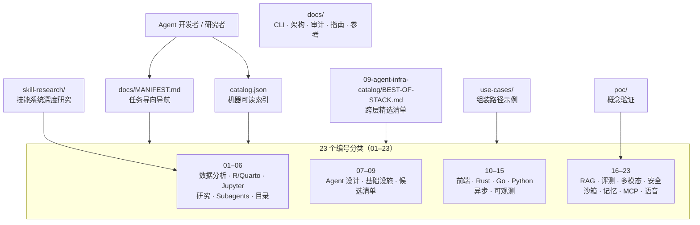

<div align="center">

# 🧭 Agent Infra Hub

**一站式 LLM Agent 基础设施参考库：精选 Skills、Subagents、编排模式与运行时组件，按 23 个分类组织，并提供机器可读索引。**

_A curated hub of LLM agent infrastructure — skills, subagents, orchestration patterns, and runtime components across 23 categories, with a machine-readable index._

<p>


</p>

</div>

---

## 📖 目录

- [简介 · About](#-简介--about)
- [系统架构 · Architecture](#-系统架构--architecture)
- [核心特性 · Features](#-核心特性--features)
- [技术栈 · Built With](#️-技术栈--built-with)
- [快速开始 · Quick Start](#-快速开始--quick-start)
- [项目结构 · Project Structure](#-项目结构--project-structure)
- [测试与校验 · Testing](#-测试与校验--testing)
- [开发路线图 · Roadmap](#️-开发路线图--roadmap)
- [文档索引 · Documentation](#-文档索引--documentation)
- [许可证 · License](#-许可证--license)

---

## 🌟 简介 · About

Agent Infra Hub 是一个面向 LLM Agent 开发者的**精选参考库**：把分散在开源社区中的 Agent 技能系统、Subagent 分工、编排框架、RAG 检索、评测、可观测、安全、沙箱、记忆、MCP 生态等基础设施组件，整理为 23 个编号分类，并配套分析文档与组装路径，帮助你按需求快速定位可复用的模块。

**我需要… → 去哪个分类：**

| 需求 | 分类 |
|------|------|
| 数据分析管道 Agent 参考 | [01-data-analysis](01-data-analysis/) |
| R / Quarto 报告与统计核验 | [02-r-quarto](02-r-quarto/) |
| Jupyter / Notebook 集成 | [03-jupyter](03-jupyter/) |
| 学术研究与写作管道 | [04-research](04-research/) |
| 专项 Subagent 分工与角色库 | [05-subagents](05-subagents/) |
| Skills 目录与资源发现 | [06-catalogs](06-catalogs/) |
| Agent 架构、Swarm 与编排设计 | [07-agent-design](07-agent-design/) |
| Hooks / 上下文 / 工具调用 / 隔离 | [08-infrastructure](08-infrastructure/) |
| 候选基础设施清单与栈分析 | [09-agent-infra-catalog](09-agent-infra-catalog/) |
| 前端标杆栈 | [10-frontend-stack](10-frontend-stack/) |
| Rust 后端组件 | [11-rust-backend](11-rust-backend/) |
| Go 后端组件 | [12-go-backend](12-go-backend/) |
| Python Agent 框架 | [13-python-agents](13-python-agents/) |
| 异步任务与消息基础设施 | [14-async-infra](14-async-infra/) |
| LLM 可观测性 | [15-observability](15-observability/) |
| RAG 检索栈 | [16-rag-stack](16-rag-stack/) |
| 模型与 RAG 评测 | [17-evaluation](17-evaluation/) |
| 多模态 Agent | [18-multimodal](18-multimodal/) |
| 安全与红队测试 | [19-safety](19-safety/) |
| 代码执行沙箱 | [20-sandbox](20-sandbox/) |
| 持久化记忆 | [21-memory](21-memory/) |
| MCP 生态 | [22-mcp-ecosystem](22-mcp-ecosystem/) |
| 语音 / 实时 Agent | [23-voice](23-voice/) |

导航入口是 [`docs/MANIFEST.md`](docs/MANIFEST.md)，机器可读索引是 [`catalog.json`](catalog.json)，跨层精选清单见 [`09-agent-infra-catalog/BEST-OF-STACK.md`](09-agent-infra-catalog/BEST-OF-STACK.md)。

---

## 🏗 系统架构 · Architecture



---

## ⚡ 核心特性 · Features

| 特性 | 说明 |
|------|------|
| 🧱 **23 个编号分类** | 从数据分析到语音 Agent，按层次编号（01–23），路径即语义 |
| 🧭 **任务导向导航** | `docs/MANIFEST.md` 按“我要做什么”组织入口，适合人与 Agent 共读 |
| 🔌 **机器可读索引** | 根目录 `catalog.json` 提供结构化资源清单，可被工具直接消费 |
| 🏆 **跨层精选清单** | `BEST-OF-STACK.md` 逐层（前端/Rust/Go/Python/RAG/评测/多模态/安全/沙箱/记忆/MCP/语音）给出标杆模块与组合建议 |
| 📚 **用例组装路径** | `use-cases/` 以真实目标（统计分析 Agent、建筑造价知识库 Agent）演示如何跨分类拼装 |
| 🔬 **技能系统研究** | `skill-research/` 收录技能文件解剖、插件系统、Hooks 等专题研究笔记 |

---

## 🛠️ 技术栈 · Built With

| 层次 | 技术选型 | 说明 |
|------|----------|------|
| 内容载体 | Markdown / JSON / YAML | 文档、`catalog.json`、`09-agent-infra-catalog/catalog.yaml` |
| 工具脚本 | Python 3.x | 数据校验与文档流水线（见 `requirements.txt`） |
| 关键依赖 | pydantic ≥ 2.7 / mcp ≥ 1.0 / PyYAML ≥ 6.0.1 / requests ≥ 2.31 / Rich ≥ 13.7 | 数据建模、MCP 工具、配置解析、HTTP、终端输出 |
| 构建入口 | Makefile | 预留 `docs` / `kb-build` 等目标（见下文说明） |

---

## 🚀 快速开始 · Quick Start

### 前置要求

- Git
- Python 3.x（仅在使用工具脚本时需要）

### 步骤

```bash
# 1. 克隆并进入项目
git clone https://github.com/CHINGBOH/agent-infra-hub.git
cd agent-infra-hub

# 2. 从导航与索引开始浏览
less docs/MANIFEST.md
python3 -m json.tool catalog.json | head -40

# 3. 按需进入分类目录，或查看跨层精选清单
less 09-agent-infra-catalog/BEST-OF-STACK.md

# 4.（可选）安装工具脚本依赖
pip install -r requirements.txt
```

> **如实说明**
> - 根目录 `main.py` 目前只是占位入口（仅打印初始化信息），不代表仓库的实际用法；本仓库的价值在于文档与索引内容。
> - `Makefile` 中的 `docs*` / `kb-*` 目标引用了 `tools/` 下的脚本（`docs_gen.py`、`agent_kb.py`），这些脚本**当前未包含在仓库中**，相关目标暂不可运行，已列入路线图。

---

## 📁 项目结构 · Project Structure

```text
agent-infra-hub/
├── 01-data-analysis/ … 08-infrastructure/   # 分类 01–08：数据、研究、Subagent、基础设施
├── 09-agent-infra-catalog/                  # 候选清单、BEST-OF-STACK.md、各批次栈分析
├── 10-frontend-stack/ … 23-voice/           # 分类 10–23：前后端栈、RAG、评测、安全、MCP 等
├── docs/                                    # MANIFEST、CLI、架构、审计、指南、参考文档
├── poc/                                     # 概念验证（poc/S-mcp-native）
├── skill-research/                          # 技能系统专题研究（01–12 + 构建指南）
├── use-cases/                               # 统计分析 / 建筑造价 Agent 组装路径
├── catalog.json                             # 机器可读资源索引
├── requirements.txt                         # 工具脚本 Python 依赖
├── Makefile                                 # 文档流水线与知识库目标（部分依赖未随仓库发布）
└── main.py                                  # 占位入口（仅打印信息）
```

---

## 🧪 测试与校验 · Testing

本仓库以文档与索引为主，**暂无自动化测试套件**。内容质量依赖文档流水线（链接检查、目录与文件系统一致性校验），其设计见 [`docs/architecture/documentation-system.md`](docs/architecture/documentation-system.md)；流水线脚本尚未随仓库发布，恢复后可通过 `make docs-check` 作为 CI 门禁。

---

## 🗺️ 开发路线图 · Roadmap

- [x] 23 个编号分类目录（01–23）与分层组织
- [x] `catalog.json` 机器可读索引
- [x] `BEST-OF-STACK.md` 跨层精选清单与多批次栈分析文档
- [x] `use-cases/` 组装路径示例（统计分析、建筑造价知识库）
- [x] `skill-research/` 技能系统专题研究
- [ ] 补全并发布 `tools/` 工具脚本（`docs_gen.py`、`agent_kb.py`），使 Makefile 目标可运行
- [ ] 接入 CI：链接检查与目录一致性门禁（`make docs-check`）
- [ ] 扩充 `poc/` 概念验证项目
- [ ] 为高频分类补充中文导读

---

## 📚 文档索引 · Documentation

| 文档 | 说明 |
|------|------|
| [docs/README.md](docs/README.md) | 文档中心总览 |
| [docs/MANIFEST.md](docs/MANIFEST.md) | 任务导向导航入口 |
| [docs/architecture/repo-layout.md](docs/architecture/repo-layout.md) | 仓库分层布局说明 |
| [docs/architecture/documentation-system.md](docs/architecture/documentation-system.md) | 文档流水线设计 |
| [docs/architecture/agent-kb-cli-agent-skill-selection.md](docs/architecture/agent-kb-cli-agent-skill-selection.md) | 知识库 CLI 与技能选择架构 |
| [docs/cli/agent-kb-cli.md](docs/cli/agent-kb-cli.md) | 知识库 CLI 使用说明（脚本待发布） |
| [docs/audits/agent-query-readiness.md](docs/audits/agent-query-readiness.md) | Agent 查询可用性审计 |
| [docs/guides/adding-new-content.md](docs/guides/adding-new-content.md) | 新增内容指南 |
| [docs/guides/cross-module-composition.md](docs/guides/cross-module-composition.md) | 跨模块组合指南 |
| [docs/guides/experimental-apis.md](docs/guides/experimental-apis.md) | 实验性 API 说明 |
| [docs/guides/wshobson-plugin-selection.md](docs/guides/wshobson-plugin-selection.md) | 插件选型指南 |
| [docs/reference/catalog-schema.md](docs/reference/catalog-schema.md) | catalog.json 结构参考 |
| [docs/reference/manifest-structure.md](docs/reference/manifest-structure.md) | MANIFEST 结构参考 |
| [docs/reference/agent_kb_cli.md](docs/reference/agent_kb_cli.md) | 知识库 CLI 命令参考 |
| [09-agent-infra-catalog/BEST-OF-STACK.md](09-agent-infra-catalog/BEST-OF-STACK.md) | 跨层精选清单 |
| [use-cases/statistical-analysis-agent.md](use-cases/statistical-analysis-agent.md) | 统计分析 Agent 组装路径 |
| [use-cases/construction-cost-knowledge-base-agent.md](use-cases/construction-cost-knowledge-base-agent.md) | 建筑造价知识库 Agent 组装路径 |
| [skill-research/README.md](skill-research/README.md) | 技能系统研究总览 |
| [poc/README.md](poc/README.md) | 概念验证说明 |

---

## 📄 许可证 · License

本项目基于 [MIT License](LICENSE) 开源。仓库中收录的第三方项目链接与内容版权归原作者及其各自许可证所有。

---

<div align="center"><sub><a href="#-agent-infra-hub">⬆ 回到顶部</a></sub></div>
