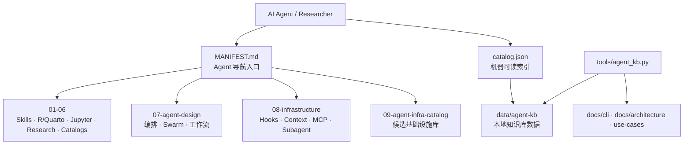

<div align="center">

# 🧭 Agent Infra Hub

**围绕 LLM 微型 OS 的 Skills、Subagents、编排与基础设施参考库**
_A curated infrastructure hub for skills, subagents, orchestration, and agent-runtime systems_

<p>


</p>

<p>


</p>

</div>

---

## 📖 简介 · About

Agent Infra Hub 是一个面向 AI Agent 基础设施的私有参考库，围绕 “LLM 作为 CPU、Skills 作为行为注入、Agent 设计作为进程架构、Hooks/Context/MCP/Subagent 作为微型 OS” 的模型组织资料。仓库汇集数据分析、R/Quarto、Jupyter、研究管道、Subagents、Skills Catalog、Agent 设计与基础设施候选库。

AI Agent 首读入口是 [`MANIFEST.md`](MANIFEST.md)，机器可读索引是 [`catalog.json`](catalog.json)。本地知识库 CLI 位于 [`tools/agent_kb.py`](tools/agent_kb.py)，说明见 [`docs/cli/agent-kb-cli.md`](docs/cli/agent-kb-cli.md)。

## ✨ 特性 · Features

- 🧱 **九大分类索引** — 从数据分析、R/Quarto、Jupyter 到 Agent 设计与基础设施候选库
- 🤖 **Agent 首读清单** — `MANIFEST.md` 为 AI Agent 提供任务导向导航
- 🧠 **本地知识库 CLI** — `tools/agent_kb.py` 支持 build、repl、ask、answer、search
- 🧩 **Skills / Subagents 目录** — 汇集 Claude Code Skills、专业 subagents 与安装参考
- 🏗️ **基础设施四支柱** — Hooks、Context Window、Tool Use / MCP、Subagent Isolation
- 📚 **用例导向文档** — `use-cases/` 覆盖统计分析 Agent、建筑造价知识库 Agent 等组装路径

## 🏗️ 架构 · Architecture



## 🚀 快速开始 · Quick Start

### 环境要求 · Prerequisites

- Git
- Python 3.x
- Markdown 阅读器或 GitHub 网页端

### 安装 · Installation

```bash
# 1. 克隆并进入项目
git clone https://github.com/CHINGBOH/agent-infra-hub.git
cd agent-infra-hub

# 2. 阅读 Agent 导航与机器索引
less MANIFEST.md
python -m json.tool catalog.json | head

# 3. 构建并查询本地知识库
./tools/agent_kb.py build
./tools/agent_kb.py search "Milvus knowledge graph construction cost"
./tools/agent_kb.py answer "我要做建筑造价知识库 agent，需要 Milvus 和知识图谱吗？"
```

## 📂 目录结构 · Project Structure

```text
agent-infra-hub/
├── 01-data-analysis/       # 数据分析管道 Agent 参考
├── 02-r-quarto/            # R、Quarto、统计核验与报告生成 Skills
├── 03-jupyter/             # Jupyter / Notebook Agent 集成
├── 04-research/            # 学术研究、写作、审阅 Skills
├── 05-subagents/           # 专项 Subagent 分工与角色库
├── 06-catalogs/            # Skills / Claude Code 资源目录
├── 07-agent-design/        # Agent 架构、Swarm、工作流与编排设计
├── 08-infrastructure/      # Hooks、Context、MCP、Subagent Isolation
├── 09-agent-infra-catalog/ # 候选 Agent 基础设施清单
├── data/                   # agent-kb 本地数据
├── docs/                   # CLI、审计、架构文档
├── skill-research/         # Skill 系统深度研究
├── tools/                  # agent_kb.py 本地知识库 CLI
├── use-cases/              # 统计分析 / 建筑造价等组装路径
├── MANIFEST.md             # AI Agent 首读入口
└── catalog.json            # 机器可读资源索引
```

## 🛠️ 技术栈 · Built With


## 📄 License

私有仓库 · Private repository. 版权归作者所有。

---

<div align="center"><sub>📐 README 遵循 <a href="https://github.com/othneildrew/Best-README-Template">Best-README-Template</a> 标准</sub></div>
