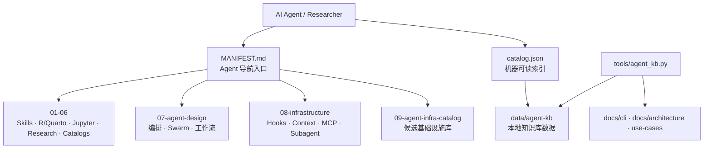

<div align="center">

# 🧭 Agent Infra Hub

**围绕 LLM 微型 OS 的 Skills、Subagents、编排与基础设施参考库**
_A curated infrastructure hub for skills, subagents, orchestration, and agent-runtime systems_

**~6.1 GB | 106 个仓库 | 23 个分类 | 7 个知识图谱**

<p>


</p>

</div>

---

## 📖 简介 · About

| 我需要… | 用这个 | 路径 |
|---------|--------|------|
| 数据分析管道 agent（中文） | claude-data-analysis-ultra | [→](#1-data-analysis-数据分析管道) |
| Quarto 报告生成 | posit-dev-skills/quarto | [→](#2-r-quarto-r--quarto-工具链) |
| 写/执行 R 统计代码 | agentic-skills/writing-r-code | [→](#2-r-quarto-r--quarto-工具链) |
| R 统计结果核验（反幻觉） | ClaudeR | [→](#2-r-quarto-r--quarto-工具链) |
| Jupyter EDA 集成 | notebook-intelligence | [→](#3-jupyter-jupyter-集成) |
| 学术报告撰写与审阅 | academic-research-skills | [→](#4-research-学术研究管道) |
| 数据分析 subagent 分工 | VoltAgent 05-data-ai | [→](#5-subagents-专项-subagent-分工) |
| 搜索更多 skills | 06-catalogs | [→](#6-catalogs-skills-目录-发现) |
| 理解 Claude Code Agent 底层架构 | Dive-into-Claude-Code | [→](#7-agent-design-agent-架构设计) |
| 多阶段工作流 + 质量门控设计 | metaswarm | [→](#7-agent-design-agent-架构设计) |
| Agent 团队角色分工（lead/impl/review） | wshobson-agents | [→](#7-agent-design-agent-架构设计) |
| 所有 Workflow 模式速查 | ultimate-guide | [→](#7-agent-design-agent-架构设计) |
| 20-50 Agent 并行 + 锁协调 | agent-farm | [→](#7-agent-design-agent-架构设计) |
| **Hooks 13个生命周期事件实现** | claude-code-hooks-mastery | [→](#8-infrastructure-基础设施四大支柱) |
| **Context 压缩 + Ghost Token 检测** | token-optimizer | [→](#8-infrastructure-基础设施四大支柱) |
| **Claude Code 作为 MCP Server** | claude-code-mcp | [→](#8-infrastructure-基础设施四大支柱) |
| **Boomerang 任务拆分 MCP 模式** | claude-code-mcp-enhanced | [→](#8-infrastructure-基础设施四大支柱) |
| **Agent Harness 完整系统（82k★）** | ECC | [→](#8-infrastructure-基础设施四大支柱) |
| **Hub-and-Spoke 上下文隔离架构** | sub-agent-collective | [→](#8-infrastructure-基础设施四大支柱) |
| **更多 Agent 架构基础设施候选仓库** | 09-agent-infra-catalog | [→](#9-agent-infra-catalog-候选库) |
| **统计分析 Agent 组装路径** | use-cases/statistical-analysis-agent.md | [→](use-cases/statistical-analysis-agent.md) |
| **建筑造价知识库 Agent 组装路径** | use-cases/construction-cost-knowledge-base-agent.md | [→](use-cases/construction-cost-knowledge-base-agent.md) |
| **Agent 查询可用性审计** | docs/audits/agent-query-readiness.md | [→](docs/audits/agent-query-readiness.md) |
| **本地知识库 CLI** | tools/agent_kb.py | [→](docs/cli/agent-kb-cli.md) |
| **Agent KB CLI 架构与 skill 选择** | docs/architecture/agent-kb-cli-agent-skill-selection.md | [→](docs/architecture/agent-kb-cli-agent-skill-selection.md) |
| 🆕 **22 模块最优 Agent 拼装表** | 09-agent-infra-catalog/BEST-OF-STACK.md | [→](09-agent-infra-catalog/BEST-OF-STACK.md) |
| 🆕 **持久化记忆 + 混合检索（53 MCP / 12 hooks / 0 DB）** | agentmemory | [→](08-infrastructure/agentmemory/) |
| 🆕 **138 科学 SKILL.md（17 个学科领域）** | scientific-agent-skills | [→](06-catalogs/scientific-skills-INDEX.md) |
| 🆕 **Claude Code 多智能体 Team 编排** | oh-my-claudecode | [→](07-agent-design/oh-my-claudecode/) |
| 🆕 **22 模块表升级到 29 模块（含前端层）** | BEST-OF-STACK.md §E | [→](09-agent-infra-catalog/BEST-OF-STACK.md) |
| 🆕 **Vite / shadcn-ui / TanStack-Query 等 7 前端标杆** | 10-frontend-stack/ | [→](10-frontend-stack/) |
| 🆕 **前端栈分析（shadcn 官方 SKILL.md 演进记录）** | 2026-05-25-frontend-stack-analysis.md | [→](09-agent-infra-catalog/2026-05-25-frontend-stack-analysis.md) |
| 🆕 **22 → 39 模块升级（含 Rust + Go 后端层）** | BEST-OF-STACK.md §F/G | [→](09-agent-infra-catalog/BEST-OF-STACK.md) |
| 🆕 **Rust 后端 6 明星（axum/qdrant/meili/tantivy/rig/ratatui）** | 11-rust-backend/ | [→](11-rust-backend/) |
| 🆕 **Go 后端 6 明星（ollama/eino/weaviate/mcp-go/gptscript/langchaingo）** | 12-go-backend/ | [→](12-go-backend/) |
| 🆕 **后端栈分析（含 AGENTS.md/CLAUDE.md 文化收获）** | 2026-05-25-backend-stack-analysis.md | [→](09-agent-infra-catalog/2026-05-25-backend-stack-analysis.md) |
| 🆕 **39 → 50 模块（含 Python agent / 异步 / 可观测）** | BEST-OF-STACK.md §H/I/J | [→](09-agent-infra-catalog/BEST-OF-STACK.md) |
| 🆕 **Python Agent 6 明星（dify/autogen/crewai/langgraph/openai-agents/smolagents）** | 13-python-agents/ | [→](13-python-agents/) |
| 🆕 **异步基础设施 3 明星（temporal/nats/cua）** | 14-async-infra/ | [→](14-async-infra/) |
| 🆕 **LLM 可观测 3 明星（langfuse/phoenix/openllmetry）** | 15-observability/ | [→](15-observability/) |
| 🆕 **Python+异步+可观测分析（AGENTS.md/CLAUDE.md 趋势统计）** | 2026-05-25-python-infra-obs-analysis.md | [→](09-agent-infra-catalog/2026-05-25-python-infra-obs-analysis.md) |
| 🆕 **50 → 59 模块（含 RAG 检索 + 评测）** | BEST-OF-STACK.md §K/L | [→](09-agent-infra-catalog/BEST-OF-STACK.md) |
| 🆕 **RAG 6 明星（ragflow/llama_index/haystack/graphrag/LightRAG/FlashRAG）** | 16-rag-stack/ | [→](16-rag-stack/) |
| 🆕 **评测 4 明星（ragas/lm-eval/BFCL/opencompass）** | 17-evaluation/ | [→](17-evaluation/) |
| 🆕 **RAG + Evaluation 分析（含 4 种 RAG 组合）** | 2026-05-25-rag-eval-analysis.md | [→](09-agent-infra-catalog/2026-05-25-rag-eval-analysis.md) |
| 🆕 **59 → 80 模块（含 M-R 六大新层）** | BEST-OF-STACK.md §M-R | [→](09-agent-infra-catalog/BEST-OF-STACK.md) |
| 🆕 **多模态（Qwen-Agent/InternVL/LLaVA/vision-agent）** | 18-multimodal/ | [→](18-multimodal/) |
| 🆕 **安全红队（garak 44 类 probe + NeMo-Guardrails 等）** | 19-safety/ | [→](19-safety/) |
| 🆕 **沙箱（e2b/daytona/pyodide/open-interpreter）** | 20-sandbox/ | [→](20-sandbox/) |
| 🆕 **记忆专题（mem0/letta/zep/cognee）** | 21-memory/ | [→](21-memory/) |
| 🆕 **MCP 生态（官方 servers + Py SDK + mcp-agent）** | 22-mcp-ecosystem/ | [→](22-mcp-ecosystem/) |
| 🆕 **语音/实时 agent（livekit 71 plugin / pipecat / vocode）** | 23-voice/ | [→](23-voice/) |
| 🆕 **第 5 批分析（六大领域汇总 + 6 种新组合）** | 2026-05-25-multimodal-safety-sandbox-memory-mcp-voice-analysis.md | [→](09-agent-infra-catalog/2026-05-25-multimodal-safety-sandbox-memory-mcp-voice-analysis.md) |

AI Agent 首读入口是 [`MANIFEST.md`](MANIFEST.md)，机器可读索引是 [`catalog.json`](catalog.json)。本地知识库 CLI 位于 [`tools/agent_kb.py`](tools/agent_kb.py)，说明见 [`docs/cli/agent-kb-cli.md`](docs/cli/agent-kb-cli.md)。

## ✨ 特性 · Features

- 🧱 **九大分类索引** — 从数据分析、R/Quarto、Jupyter 到 Agent 设计与基础设施候选库
- 🤖 **Agent 首读清单** — `MANIFEST.md` 为 AI Agent 提供任务导向导航
- 🧠 **本地知识库 CLI** — `tools/agent_kb.py` 支持 build、repl、ask、answer、search
- 🧩 **Skills / Subagents 目录** — 汇集 Claude Code Skills、专业 subagents 与安装参考
- 🏗️ **基础设施四支柱** — Hooks、Context Window、Tool Use / MCP、Subagent Isolation
- 📚 **用例导向文档** — `use-cases/` 覆盖统计分析 Agent、建筑造价知识库 Agent 等组装路径

## 🏗️ 架构 · Architecture



## 🚀 快速开始 · Quick Start

### 环境要求 · Prerequisites

- Git
- Python 3.x
- Markdown 阅读器或 GitHub 网页端

### 安装 · Installation

```bash
# 1. 克隆并进入项目
git clone https://github.com/CHINGBOH/agent-infra-hub.git
cd agent-infra-hub

# 2. 阅读 Agent 导航与机器索引
less MANIFEST.md
python -m json.tool catalog.json | head

# 3. 构建并查询本地知识库
./tools/agent_kb.py build
./tools/agent_kb.py search "Milvus knowledge graph construction cost"
./tools/agent_kb.py answer "我要做建筑造价知识库 agent，需要 Milvus 和知识图谱吗？"
```

## 📂 目录结构 · Project Structure

```text
agent-infra-hub/
├── 01-data-analysis/       # 数据分析管道 Agent 参考
├── 02-r-quarto/            # R、Quarto、统计核验与报告生成 Skills
├── 03-jupyter/             # Jupyter / Notebook Agent 集成
├── 04-research/            # 学术研究、写作、审阅 Skills
├── 05-subagents/           # 专项 Subagent 分工与角色库
├── 06-catalogs/            # Skills / Claude Code 资源目录
├── 07-agent-design/        # Agent 架构、Swarm、工作流与编排设计
├── 08-infrastructure/      # Hooks、Context、MCP、Subagent Isolation
├── 09-agent-infra-catalog/ # 候选 Agent 基础设施清单
├── data/                   # agent-kb 本地数据
├── docs/                   # CLI、审计、架构文档
├── skill-research/         # Skill 系统深度研究
├── tools/                  # agent_kb.py 本地知识库 CLI
├── use-cases/              # 统计分析 / 建筑造价等组装路径
├── MANIFEST.md             # AI Agent 首读入口
└── catalog.json            # 机器可读资源索引
```

## 🛠️ 技术栈 · Built With


## 📄 License

私有仓库 · Private repository. 版权归作者所有。

---

<div align="center"><sub>📐 README 遵循 <a href="https://github.com/othneildrew/Best-README-Template">Best-README-Template</a> 标准</sub></div>
